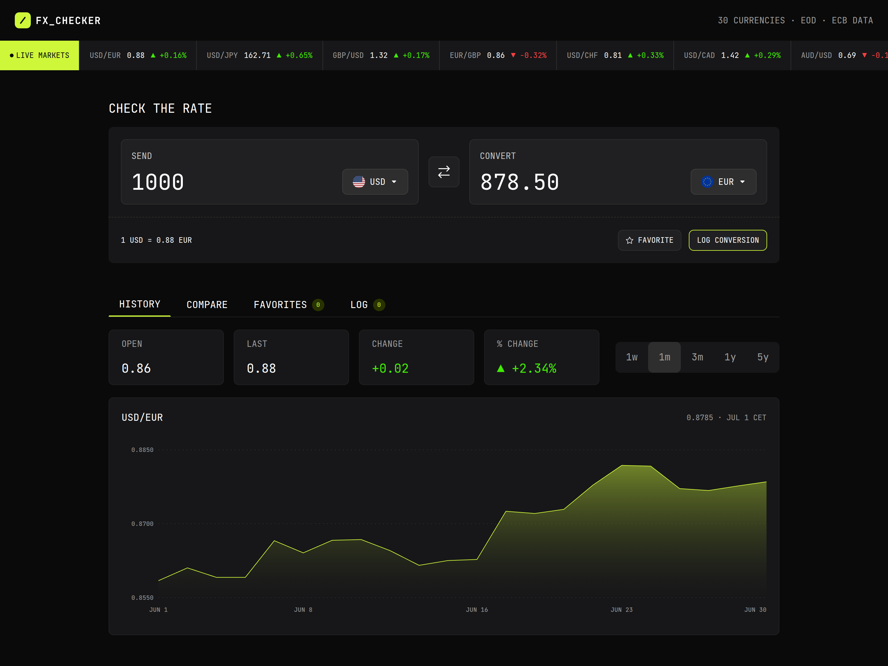
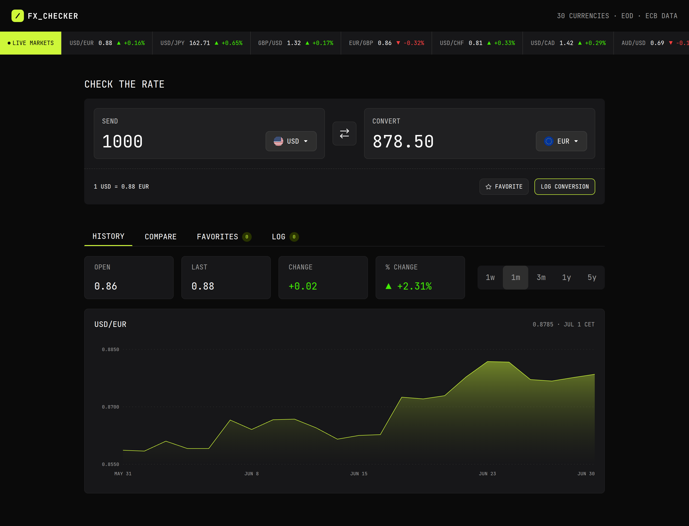
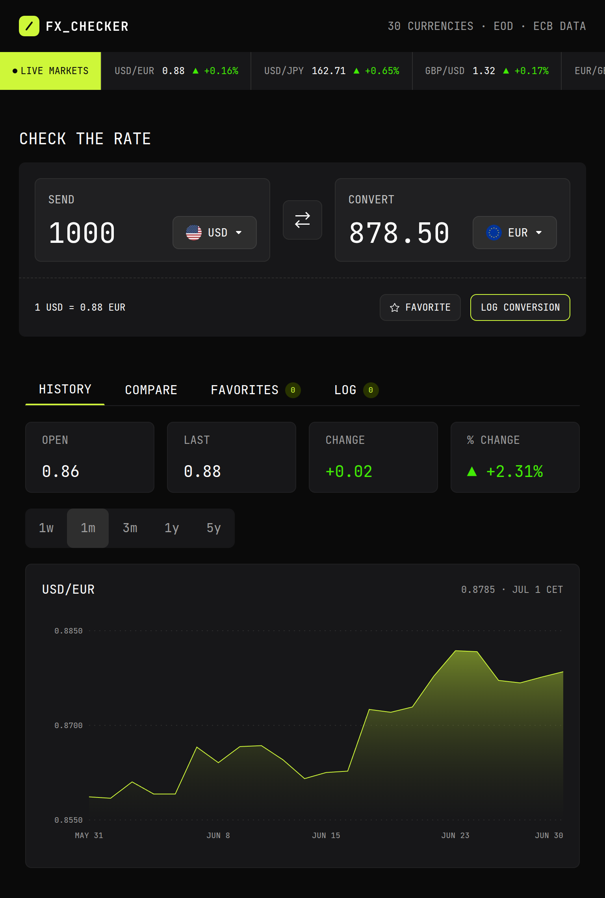
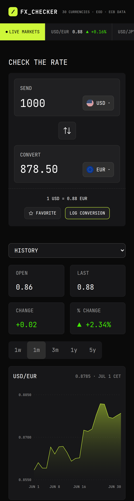

# 💱 FX Checker

> A modern currency exchange application built for the Frontend Mentor FX
> Checker Hackathon.



## 🔗 Links

- **Live Demo:** https://fx-checker-blue.vercel.app/
- **Repository:** https://github.com/GabrielHenrique17y/FX_checker.git
- **Frontend Mentor Solution:**

---

# 📖 About

FX Checker is a currency exchange application that allows users to convert
currencies, compare exchange rates, visualize historical data, monitor live
markets, and manage favorite currency pairs through an intuitive and responsive
interface.

---

# ✨ Features

- ✅ Currency conversion
- ✅ Historical exchange rate chart
- ✅ Live Markets ticker
- ✅ Compare multiple currencies
- ✅ Favorite currency pairs
- ✅ Responsive design

---

# 📸 Screenshots

## Desktop


## Tablet



## Mobile



---

# 🛠️ Built With

- Next.js 16
- React 19
- TypeScript
- Tailwind CSS
- Frankfurter API

---

# 🚀 Getting Started

Clone the repository

```bash
git clone https://github.com/GabrielHenrique17y/FX_checker.git
```

Install dependencies

```bash
npm install
```

Run the development server

```bash
npm run dev
```

Open

```
http://localhost:3000
```

---

---

# 📁 Project Structure

```
.
├── app
│   ├── action
│   ├── component
│   ├── lib
│   ├── types
│   ├── utils
│   ├── page.tsx
│   ├── layout.tsx
│   └── globals.css
└── public


```

---

# 🧠 Technical Decisions

This project was designed with performance and scalability in mind.

---

### Data Fetching

- Cached requests
- Revalidation strategy

---

### Live Markets

- 10 fixed currency pairs
- 10 deterministic daily random pairs generated using `seedrandom`
- Exchange rates calculated locally from a single base currency
- Daily percentage change calculated without additional API requests

---

# 🤖 AI Collaboration

This project was developed with assistance from ChatGPT.

AI was used to:

- discuss architecture decisions;
- review code;
- explain API behavior;
- improve algorithms;
- assist in debugging.

All implementation decisions, testing, and final code were reviewed and
completed manually.

---

# 🙏 Acknowledgements

- Frankfurter API
- React
- Next.js

---

# 📄 License

This project is licensed under the MIT License.
